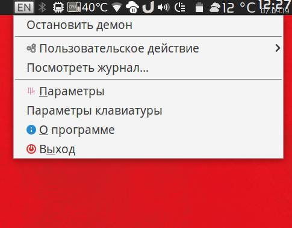

## Генератор иконок для gXNeur

Для замены стандартной иконки на серые иконки текущей раскладки.

В настройках gXNeur нужно выбрать "Показывать значки из каталога" и указать каталог с сгенерированными иконками.

В Makefile при необходимости можно поменять размер иконок (по-умолчанию — 32x32)

Исходные - svg-иконки [Language Flags for Faenza Dark Panel](https://www.gnome-look.org/content/show.php/Language+Flags+for+Faenza+Dark+Panel?content=133910)

